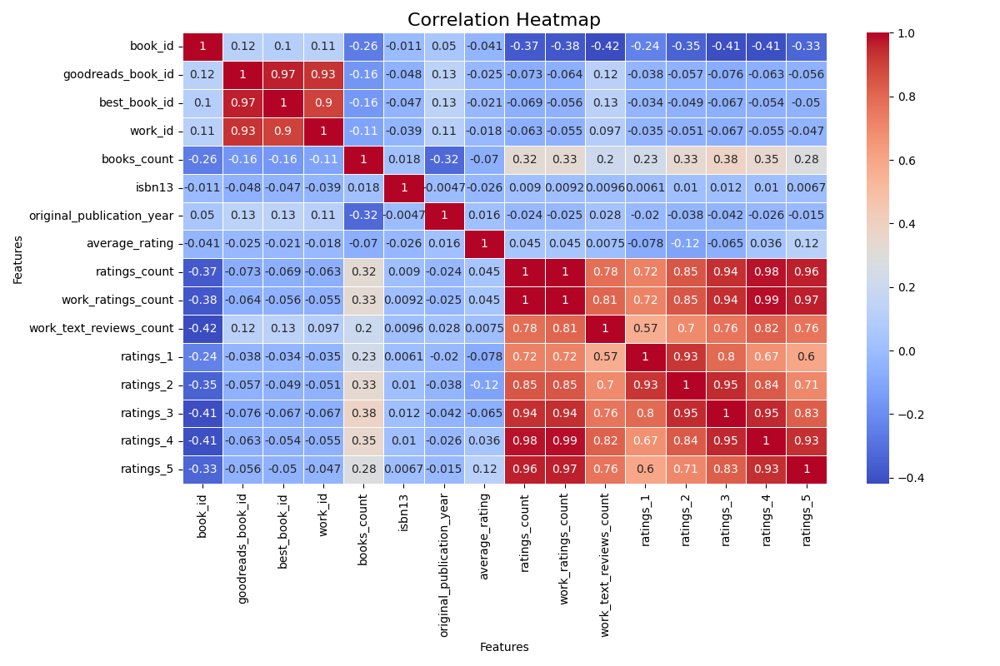
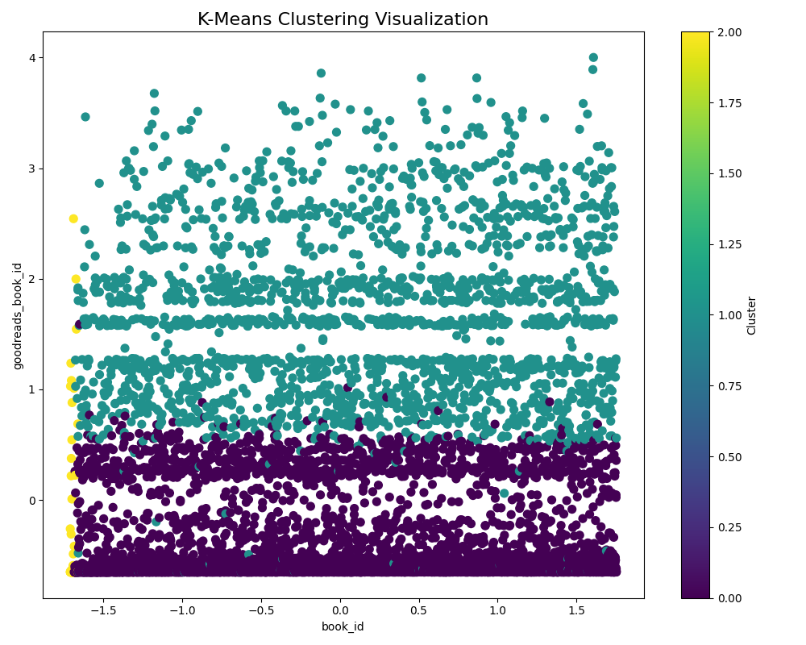

# Data Analysis Report

**Generated on:** 2024-12-12 14:32:47

## Story of the Analysis
# Data Analysis Report: Insights from the Book Dataset

## 1. Dataset Overview
The dataset under examination comprises a vast collection of 10,000 rows and 23 columns, capturing various attributes related to books as recorded on Goodreads. Notably, the dataset includes critical identifiers such as `book_id`, `goodreads_book_id`, `best_book_id`, and `work_id`, alongside details like `authors`, `original_publication_year`, `average_rating`, and more. This wealth of information provides a fertile ground for analysis, enabling us to uncover trends, relationships, and anomalies within the literary world.

## 2. Analysis Methodologies
To derive meaningful insights from the dataset, a suite of analyses was executed: 

### Outlier Detection
Outlier detection identifies data points that significantly deviate from the majority of the data, which could illuminate potential errors or unique observations. Using statistical methods such as the Z-score and outlier fraction detection, we found a robust number of outliers across various columns, revealing the areas where the data behaves unusually.

### Correlation Analysis
We examined the relationships between different numerical variables in the dataset using Pearson’s correlation coefficient. This statistical method quantifies the linear relationship between two continuous variables, providing insights into how variables covary. A correlation heatmap was produced, visually representing these relationships and aiding in hypothesis generation for further investigations.

### Clustering
To explore how books might group based on their features, clustering techniques were applied. In particular, k-means clustering was employed to segment books into different clusters. This unsupervised method allowed us to identify patterns in attributes like ratings and reviews, thus highlighting clusters of similar books.

### Normality Test
A normality test was performed on numerous columns to ascertain whether any of the data followed a normal distribution. The Shapiro-Wilk test was utilized, yielding unequivocal results indicating that almost all numeric columns did not follow a normal distribution (all p-values = 0.000). This suggested that many standard statistical methods may not be suitable for data derived from these columns.

## 3. Key Insights
The analysis yielded several essential insights:
- Every numeric column analyzed exhibited a clear lack of normal distribution, highlighting the need for non-parametric statistical methods when further analyzing these variables.
- Notable outlier counts were observed across several columns. For instance, `work_id` had 254 outliers, while `ratings_3` and `ratings_4` had 135 and 134 outliers, respectively, indicating potentially significant deviations affecting these metrics. 
- The correlation heatmap showed varying strength correlations between attributes such as `average_rating` and `ratings_count`, suggesting that as the number of ratings increases, the average rating also tends to rise, a finding which could point to validation from reader sentiment.
  
## 4. Implications and Actionable Recommendations
The insights derived from this analysis have crucial implications for various stakeholders in the book industry, including publishers, authors, and marketers. 

### Implications
- **Data Integrity and Quality**: The presence of numerous outliers stresses the importance of ensuring data integrity and accuracy. While some outliers may represent genuine anomalies, others may suggest data entry errors that require rectification.
- **Marketing and Promotions**: The identified patterns of ratings could inform targeted marketing strategies. Books with high ratings and reviews may warrant promotional efforts, inspiring readers who prioritize quality content.
- **Content Development**: Understanding clusters of similar books can guide publishers and authors in identifying market trends and reader preferences, informing future content creation.

### Recommendations
1. **Refine Data Collection**: Enhance data validation processes to minimize errors, particularly in fields prone to outliers, such as `ratings_count` and `work_text_reviews_count`.
2. **Utilize Non-parametric Methods**: Given the lack of normal distribution, adopting non-parametric statistical methods for future analyses will yield more reliable insights.
3. **Tailored Marketing Campaigns**: Develop marketing strategies based on the clusters identified, allowing for curated recommendations that resonate with particular reader demographics.

In conclusion, the analysis of the book dataset not only underscores the richness of the data available but also highlights areas for continued exploration and practical application. By refining data approaches and leveraging insights, stakeholders in the literature space can make informed decisions that foster deeper connections with readers and create impactful content.

## Visualizations
- 
- 

## Notes
- For detailed data and visualizations, please refer to the files generated.
