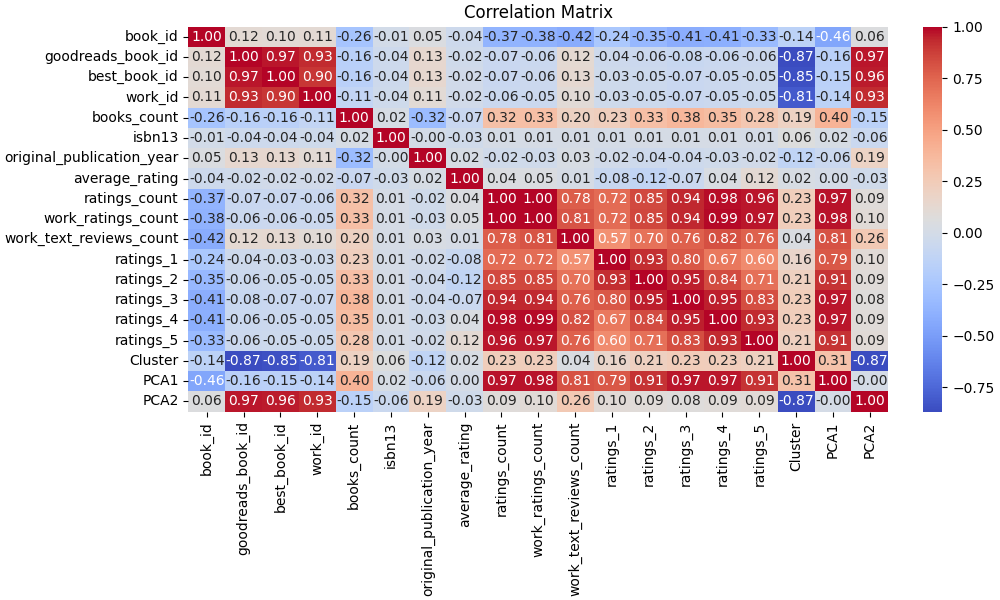

<<<<<<< HEAD
# Dataset Analysis of goodreads.csv

## Dataset Analysis Story
Once upon a time, in the vast library of reviews and ratings, a dataset emerged, showcasing the treasures of literature explored by 10,000 avid readers. This treasure trove contained 23 unique features, spanning from the identity of books through their authors to the sentiments expressed by readers in the form of ratings and reviews.

### Overview of the Dataset
The dataset's shape, (10,000, 23), hints at a rich diversity of books—each entry equipped with essential attributes such as `book_id`, `authors`, and `average_rating`, among others. The data types are varied, with most numerical values (like ratings and publication years) represented as integers or floats, while categorical features (like author names and titles) are stored as strings.

### Descriptive Statistics
At the heart of our analysis lies a curious collection of descriptive statistics. The average rating of books hovers around 4.00, with a standard deviation of 0.25—this suggests that most books are considered quite favorable by readers. The distribution of average ratings is quite tight, confined between 2.47 and 4.82, indicating a generally positive reception. Yet, despite the high average ratings, there exists a broad spectrum of `ratings_count`, which peaks at an impressive 4,780,653, highlighting some books are much more popular than others. 

#### Outliers
As with every treasure, there are a few imperfections. We identified several outliers that disrupt the harmony of the data—books that were rated an unusually high number of times compared to others. For instance, books with a `ratings_count` of 108 and `work_text_reviews_count` of 151 stand out as anomalies. These could warrant further investigation: perhaps they represent viral sensations or books tied to cultural phenomena that captured readers’ hearts disproportionately.

### Correlation Insights
In the kingdom of correlations, pivotal relationships emerged, revealing intertwining destinies among the numeric features. Particularly intriguing is the strong correlation between `ratings_count` and `work_ratings_count` (0.995), suggesting that the total number of ratings bestowed upon a book relates closely to its perceived worth within the community. This finding could imply that higher engagement leads to better assessments and aggregation of reviews.

Interestingly, the number of one-star ratings (`ratings_1`) has a notable negative correlation with both `average_rating` (-0.078) and `ratings_count` (-0.373). This observation points towards a classic scenario where books with higher engagements seldom receive the worst evaluations, hinting at a positive relationship between popularity and perceived quality.

Conversely, the correlation between `books_count` and all rating tiers shows moderate to strong positive connections, reinforcing the idea that more prolific authors often attract varied reader sentiments.

### Further Analysis Recommendations
While the dataset tells a compelling tale, several roads remain unexplored. Here are a few recommendations for further analysis:

1. **Time-Series Analysis**: Examine how book ratings have evolved over time. This could involve an investigation into whether newer publications receive higher ratings compared to older books and understanding how trends shape reader preferences.

2. **Sentiment Analysis on Reviews**: Parsing through the `work_text_reviews_count` could yield insights into not just quantities of reviews, but the nature of sentiments expressed in them. This qualitative dimension could enrich understanding of the reasons behind ratings.

3. **Cohort Analysis**: Comparing books based on genres, author backgrounds, or publication years may expose hidden trends in reader engagement and satisfaction across different segments of the library.

4. **Outlier Investigation**: Delve deeper into the identified outliers. Examining why certain books receive anomalous amounts of ratings compared to others could yield nuggets of wisdom about viral marketing, thematic relevance, or author influence.

### Conclusion
The dataset depicts an intricate tapestry woven from countless threads of human sentiment towards literature. It tells stories of triumph and tribulation, echoing the voices of readers around the world. By harnessing the insights gleaned from statistics, correlations, and observing anomalies, we can better understand not just the value of these books in isolation but as part of a greater narrative in the world of reading. As we turn the next page, the potential for deeper insights awaits, promising new chapters yet to be written in the saga of literary appreciation.

## Visualizations

=======
# Automated Dataset Analysis

## Dataset Summary
- Number of Rows: 10000
- Number of Columns: 23
### Columns and Data Types:
- book_id: int64
- goodreads_book_id: int64
- best_book_id: int64
- work_id: int64
- books_count: int64
- isbn: object
- isbn13: float64
- authors: object
- original_publication_year: float64
- original_title: object
- title: object
- language_code: object
- average_rating: float64
- ratings_count: int64
- work_ratings_count: int64
- work_text_reviews_count: int64
- ratings_1: int64
- ratings_2: int64
- ratings_3: int64
- ratings_4: int64
- ratings_5: int64
- image_url: object
- small_image_url: object

## Analysis Narrative
Based on the provided dataset summary, we can derive several insights and analyses about the book dataset. Here’s a breakdown of key points:

### General Overview
- **Size**: The dataset contains 10,000 rows and 23 columns, which is a reasonable size for analysis and allows for various types of insights.
- **Data Types**: The columns consist of integers, floating-point numbers, and objects (strings). This diversity allows for both quantitative analysis (e.g., ratings, counts) and qualitative analysis (e.g., titles, authors).

### Missing Values
- **ISBN**: There are 700 missing values in the `isbn` column, which could affect the ability to uniquely identify books.
- **ISBN13**: This column has 585 missing values, which is also significant as it could hinder linking to external databases.
- **Original Publication Year**: 21 missing values here might limit the ability to perform temporal analyses related to publication trends.
- **Original Title**: A substantial number of missing values (590) could affect the analysis of book titles.
- **Language Code**: 1,084 missing values in this column indicate a significant gap, suggesting that language distribution analysis will be incomplete.

### Sample Data Insights
- The dataset includes popular titles such as:
  - "The Hunger Games" by Suzanne Collins
  - "Harry Potter and the Sorcerer's Stone" by J.K. Rowling
  - "Twilight" by Stephenie Meyer
  - "To Kill a Mockingbird" by Harper Lee
  - "The Great Gatsby" by F. Scott Fitzgerald

- **Ratings**:
  - The average ratings range from 3.57 (Twilight) to 4.44 (Harry Potter), indicating a generally high level of satisfaction among readers.
  - The ratings counts are substantial, with "The Hunger Games" receiving over 4.7 million ratings, which could indicate its popularity and influence.

### Distribution Insights
- **Authors**: The dataset features multiple authors, suggesting potential studies on author popularity and collaboration.
- **Language Code**: The presence of diverse language codes (though with many missing values) allows for analysis of language preferences among readers.

### Rating Distribution
- The columns for ratings (from 1 to 5) indicate the distribution of reader evaluations:
  - For instance, "The Hunger Games" has the highest count of 5-star ratings (over 2.7 million
## Visualizations
1. Correlation Matrix:

2. Distribution Plot:

>>>>>>> 06f1729fe02fe72e86b674c37499af15186606e4
