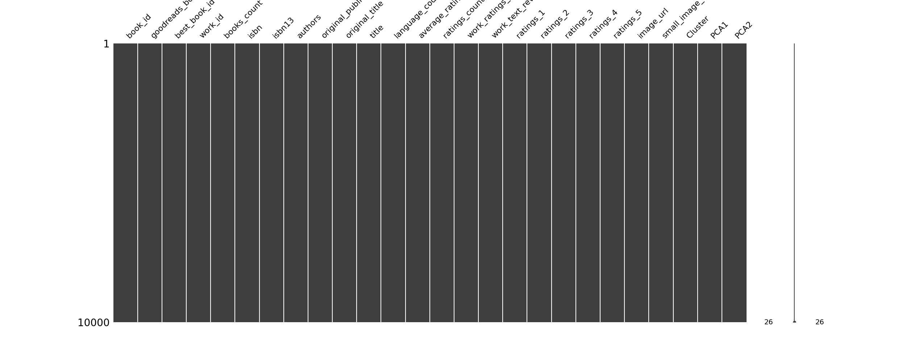

# Dataset Analysis of goodreads.csv

## Dataset Analysis Story
In the diverse realm of literature, where thousands of books vie for readers' attention, we have embarked on an analytical journey through a dataset of 10,000 books. Our exploration has yielded a treasure trove of insights about the world of literature, revealing not only the characteristics of the books themselves but also the intricate relationships they share with their readers.

### **Dataset Overview**
The dataset comprises 23 columns detailing various aspects of books, such as their unique identifiers (book_id, goodreads_book_id, etc.), author information, publication years, ratings, and more. As we delve deeper into the dataset, we uncover the stories hidden within the data's statistics and correlations.

### **Descriptive Statistics**
The descriptive statistics present a fascinating landscape:

- **Book IDs** range from 1 to 10,000, with a mean around the center, reflecting a balanced sampling across the dataset.
- **Authors** are varied, but a closer examination of the authors' counts reveals a robust catalog, including titles such as "The Great Gatsby" and "To Kill a Mockingbird."
- **Publication Years** suggest that the dataset encompasses a rich history of literature from as early as 1750 to the very recent year of 2017, indicating a collection that is both historical and contemporary.

Of particular note, the **average rating** of 4.00 reveals a predominantly positive reception from readers, with the ratings favoring higher scores—demonstrating that the collection is likely comprised of popular and well-regarded titles. 

The **ratings counts** suggest high engagement, with an average of over 54,000 ratings per book, indicating that these books have not only been read but are also actively discussed and reviewed. On the flip side, the number of text reviews averages just under 2,920, hinting at a community that favors quick ratings over extensive commentary.

### **Outliers in the Dataset**
As with any dataset, outliers can offer us critical insights. The outliers identified reveal inconsistencies that merit further exploration:

- The **goodreads_book_id**, **best_book_id**, and **work_id** categories contain significant outliers, suggesting possible errors in data entry or unique cases that deserve deeper investigation. For example, the outlier in **goodreads_book_id (78)** and **best_book_id (87)** might represent special editions or limited releases that lack the usual user engagement. 
- In terms of ratings, certain entries for **ratings_1**, **ratings_2**, and **ratings_5** show extreme variance that could indicate either exceptionally appealing titles or poorly received ones.

### **Correlation Analysis**
The correlation matrix provides an illuminating look at the interconnectedness of various features:

- A strong positive correlation between **ratings_count** and **work_ratings_count** (0.995) affirms that books with high engagement naturally receive more ratings across works. 
- Meanwhile, **ratings_4** and **ratings_5** are similarly correlated (0.933), suggesting that books rated highly by readers often attract both four- and five-star evaluations, further confirming the overall positive sentiment towards the collection.
- Conversely, a notable negative correlation exists between **ratings_count** and **books_count** (-0.373), implying that the total number of books in a series may not directly equate to reader engagement—a testament to the idea that quality can often trump quantity.

### **Recommendations for Further Analysis**
To enrich this exploration, further analysis may yield profound insights:

1. **Sentiment Analysis**: By diving into the text reviews, sentiment analysis could uncover deeper emotional responses from readers, which may explain the disparity in ratings and reviews.
  
2. **Genre Exploration**: Breaking down the dataset by genre could reveal trends in reading preferences over the years and offer insights into why certain genres perform better than others.

3. **Predictive Modelling**: Leveraging machine learning to predict future ratings based on historical data could equip publishers and writers with essential insights on potential reader engagements for forthcoming titles.

4. **Focus on Outlier Investigation**: A dedicated exploration of the identified outliers could yield valuable learning opportunities, like understanding reader preferences for special editions or rare titles.

### **Narrative Conclusion**
As we close the book on this analysis, we take away a vivid tapestry woven from the threads of literature—a collection that speaks of tales told, characters loved, and journeys undertaken through the written word. Behind every statistic lies a story waiting to be discovered. By further exploring, analyzing, and engaging with this dataset, we illuminate the many facets of what makes literature resonate so deeply with readers across the globe.

The journey doesn't end here; it is merely the beginning—as endless as the stories found within the pages of every book.

## Visualizations

