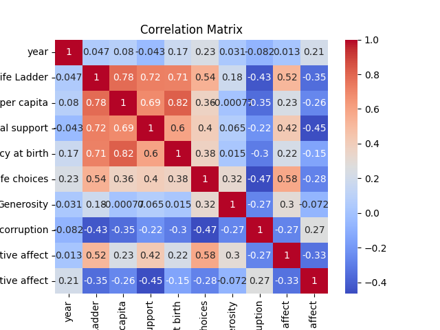
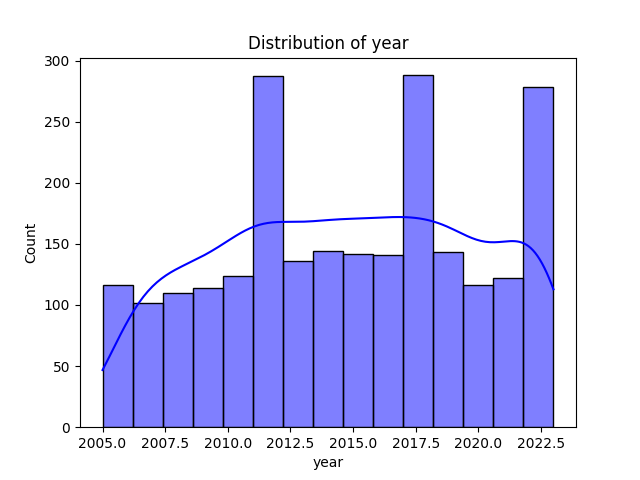

# Automated Dataset Analysis

## Dataset Summary
- Number of Rows: 2363
- Number of Columns: 11
### Columns and Data Types:
- Country name: object
- year: int64
- Life Ladder: float64
- Log GDP per capita: float64
- Social support: float64
- Healthy life expectancy at birth: float64
- Freedom to make life choices: float64
- Generosity: float64
- Perceptions of corruption: float64
- Positive affect: float64
- Negative affect: float64

## Analysis Narrative
The dataset you have provided comprises 2363 rows and 11 columns, capturing various indicators related to well-being across different countries and years. Here's a detailed analysis and insights drawn from the dataset:

### Overview of Columns
1. **Country name**: The name of the country.
2. **Year**: The year the data corresponds to.
3. **Life Ladder**: A subjective measure of well-being or happiness, typically on a scale from 0 to 10.
4. **Log GDP per capita**: The logarithm of GDP per capita, which is a common economic indicator of wealth.
5. **Social support**: A measure of perceived social support (0 to 1 scale).
6. **Healthy life expectancy at birth**: The average number of years a newborn is expected to live in good health.
7. **Freedom to make life choices**: A measure of the perceived freedom individuals have to make choices (0 to 1 scale).
8. **Generosity**: A measure of generosity, often based on charitable donations (0 to 1 scale).
9. **Perceptions of corruption**: A measure of the perceived level of corruption in the government and businesses (0 to 1 scale).
10. **Positive affect**: A measure of positive emotions experienced (0 to 1 scale).
11. **Negative affect**: A measure of negative emotions experienced (0 to 1 scale).

### Missing Values
- The dataset has several columns with missing values:
  - **Log GDP per capita**: 28 missing values
  - **Social support**: 13 missing values
  - **Healthy life expectancy at birth**: 63 missing values
  - **Freedom to make life choices**: 36 missing values
  - **Generosity**: 81 missing values
  - **Perceptions of corruption**: 125 missing values
  - **Positive affect**: 24 missing values
  - **Negative affect**: 16 missing values

  The presence of missing values in key indicators such as GDP and healthy life expectancy should be addressed, as they could impact the overall analysis.

### Insights and Potential Analysis
1. **Trends Over Time**:
   - A time series analysis can be performed to assess how the Life Ladder scores have changed over the years for different countries. This could reveal trends in happiness and well-being over time.

2. **Correlation Analysis**:
   - Correlation
## Visualizations
1. Correlation Matrix:

2. Distribution Plot:

