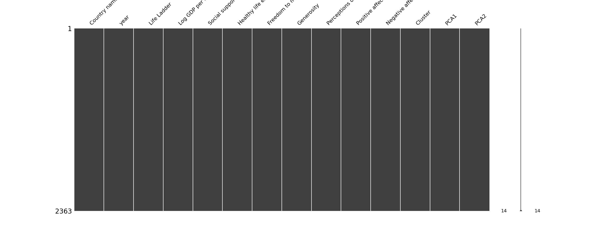
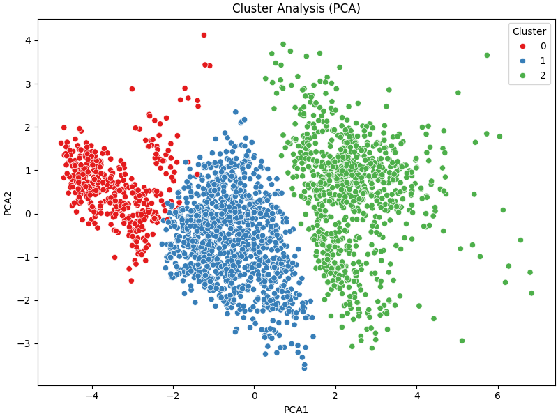

# Dataset Analysis of happiness.csv

## Dataset Analysis Story
### Insights from the Global Well-Being Dataset

Once upon a time, in a world scattered across the globe, people experienced varying degrees of happiness and fulfillment, as captured by a fascinating dataset. This dataset comprised 2,363 rows of observations across 11 different columns detailing crucial factors such as life satisfaction, economic prosperity, and social well-being. What follows is a journey through the statistics, correlations, outliers and a glimpse into possible paths forward for further analysis.

#### A Glimpse into the Numbers

The dataset covers a period stretching from 2005 to 2023, with a mean year around 2014. This timeline paints a broad picture of societal progress over nearly two decades. The *Life Ladder*, a proxy for subjective well-being, averaged 5.48, signifying that, on a scale from 0 to 10, the average person feels a sense of moderate satisfaction with their life. However, the standard deviation of 1.13 indicates that experiences of happiness vary widely, with some individuals rating their life satisfaction as low as 1.28.

Interestingly, the average *Log GDP per capita* is 9.40, suggesting that this dataset encapsulates wealthier nations, where higher consumption tendencies might correlate with higher happiness levels. The relationship between economic indicators and happiness is further underscored by a substantial correlation of **0.774** between the *Life Ladder* and *Log GDP per capita*. This alignment showcases that, generally, as nations grow economically, their citizens’ subjective well-being tends to improve.

#### Understanding the Social Fabric

Next, we look at *Social Support*, with an average score of 0.81. This statistic reveals that communities with strong interpersonal connections tend to thrive. The correlation of **0.721** between *Social Support* and *Life Ladder* reinforces the idea that humans thrive when they feel socially connected, emphasizing the importance of relationships in fostering happiness.

Also noteworthy is *Healthy Life Expectancy at Birth*, averaging 63.4 years, with strong correlations to well-being indicators like the Life Ladder (**0.710**) and economic factors (**0.808**). Herein lies an important narrative: health, wealth, and happiness intertwine tightly.

#### The Freedom to Choose

The *Freedom to Make Life Choices* statistic, averaging 0.75 with a maximum of 0.985, suggests that across many countries, individuals enjoy significant personal agency. This freedom correlates positively with life satisfaction (**0.536**), underscoring the notion that autonomy significantly enhances feelings of happiness.

Conversely, the measure of *Generosity* and its minuscule average of just 0.0000977 sheds light on a fascinating dichotomy—while people tend to place immense importance on happiness, they may struggle with generosity or philanthropy, needing encouragement or structural support for charitable behaviors.

#### The Darker Sides

However, every tale has its shadows. In this case, the *Perceptions of Corruption* stands at an average of 0.744, highlighting that individuals are frequently aware of corruption within their societies. A significant negative correlation of **-0.422** with life satisfaction indicates a bitter reality: as perceptions of corruption rise, satisfaction tends to diminish.

Similarly, *Positive Affect* and *Negative Affect* are interconnected and present a deeper understanding of emotional balance. Positive Affect averages 0.652, while Negative Affect averages 0.273—confirming the emotional spectrum individuals navigate.

#### The Outliers’ Influence

Among our journey through statistics, certain outliers beckon attention. For instance, 23 instances of *Social Support* report extreme variations, suggesting that in certain societies or communities, individuals experience radically different social frameworks. Similarly, life satisfaction outliers hint toward accommodating factors that dramatically shift perception from joy to despair.

#### Recommendations for Further Analysis

Guided by these discoveries, several paths of inquiry open up for future analysis:

1. **Longitudinal Studies**: A deeper investigation into how individual countries have progressed over time offers insights into long-term trends with specific policies that have been successful in enhancing well-being.

2. **Cross-Sectional Studies**: Analyzing differences among regions with varied *Social Support* and *Perceptions of Corruption* can illuminate factors contributing to the joys and tribulations of life in those regions.

3. **Further Exploration of Outliers**: Delving deeper into the reasons behind extreme values, such as why certain countries experience exceptionally high or low Life Ladder scores, could yield valuable insights.

4. **Impact of Generosity Initiatives**: Understanding how societal structures affect generosity measures—and subsequently, people’s happiness—will offer meaningful interventions that can elevate well-being.

In conclusion, this dataset serves as a compass—guiding policymakers, researchers, and advocates across continents and cultures. As we move forward, embracing the essence of well-being through collaboration, understanding, and informed action will pave the way to

## Visualizations

