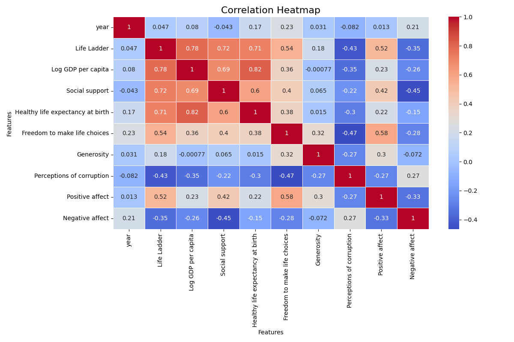
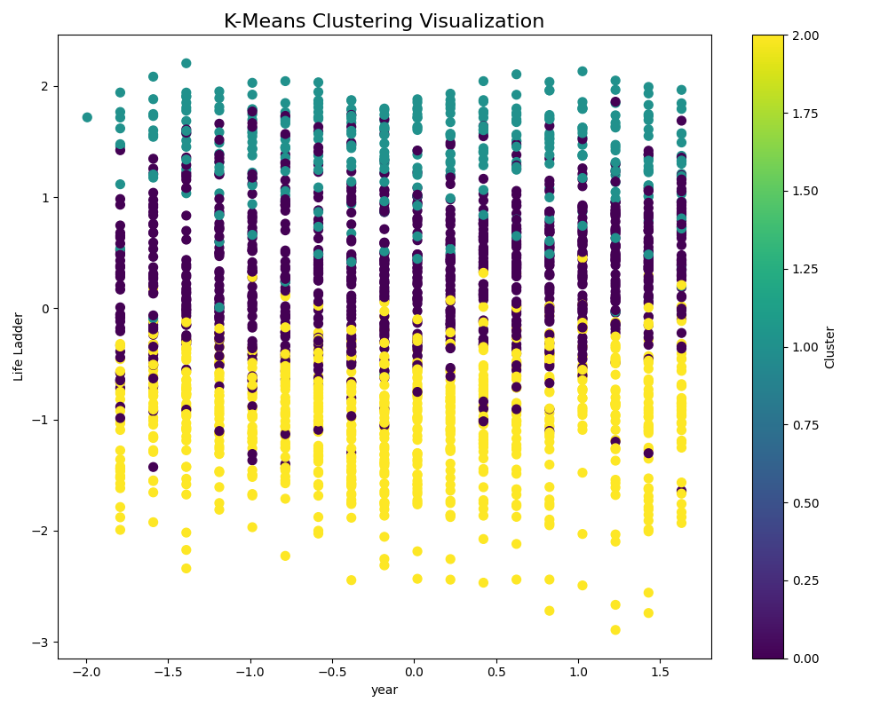

# Data Analysis Report

**Generated on:** 2024-12-12 14:36:51

## Story of the Analysis
## Data Story: Analyzing Well-being Indicators Across Countries

### 1. Dataset Overview:
The dataset under analysis comprises 2,363 rows and 11 columns, providing a wealth of information on various well-being indicators across different countries. These indicators encompass subjective measures, such as the ‘Life Ladder,’ as well as concrete factors like economic metrics, social cohesion, and overall health. The columns included are:

- **Country name** 
- **Year** 
- **Life Ladder** (a subjective well-being measure)
- **Log GDP per capita**
- **Social support**
- **Healthy life expectancy at birth**
- **Freedom to make life choices**
- **Generosity**
- **Perceptions of corruption**
- **Positive affect**
- **Negative affect**

This dataset enables a comprehensive view into how these factors interplay to shape the well-being of populations around the globe.

### 2. Analysis Breakdown:
In our pursuit to identify patterns and insights within this dataset, we performed four key analyses:

- **Outlier Detection:** We employed statistical techniques to identify data points that deviate significantly from the norm. This process helps us pinpoint potentially erroneous data and significant events that could skew overall analyses.

- **Correlation Analysis:** Utilizing Pearson correlation coefficients, we examined the relationships between all included variables. This statistical measure allows us to determine the strength and direction of relationships, offering insights into how different factors relate to well-being.

- **Clustering:** We applied clustering algorithms to categorize countries based on similarities in their well-being indicators. This technique aids in uncovering natural groupings among nations, enabling better understanding and comparison.

- **Normality Test:** We conducted normality tests (specifically the Shapiro-Wilk test) to assess whether the distributions of various indicators conformed to a normal distribution. This test is crucial for determining the appropriateness of certain statistical analyses.

### 3. Key Insights:
The analysis yielded several critical findings:

- **Non-Normal Distributions:** All key columns, including ‘year’ and various well-being indicators such as ‘Life Ladder’ and ‘Log GDP per capita,’ do not follow a normal distribution (all p-values reported at 0.000). This indicates that the underlying data may be heavily skewed or contain outliers, which is critical for future analyses and interpretations.

- **Outlier Identification:** Notable outliers were detected across various metrics:
  - ‘Life Ladder’ has 2 outliers,
  - ‘Log GDP per capita’ has 3,
  - ‘Social support’ has a significant 23,
  - Various other indicators, such as ‘Generosity’ and ‘Perceptions of corruption,’ also have notable outliers, indicating significant deviations in those metrics.

- **Correlation Dynamics:** The correlation heatmap (refer to correlation_heatmap.png) reveals intricate links between different indicators. For instance, higher ‘Log GDP per capita’ often correlates with greater ‘Social support’ and an increased ‘Life Ladder,’ suggesting a strong economic connection to perceived well-being.

- **Clustering Visualization:** The clustering analysis (illustrated in clustering_visualization.png) formed distinct groups of countries based on their well-being scores, indicating potential cultural or economic trends that could inform policy.

### 4. Implications and Actionable Recommendations:
The implications of these findings are profound:

1. **Targeted Interventions:** Countries showing significant outlier behavior in areas like ‘Social support’ should be examined closely. It may indicate areas where governmental or non-profit interventions could help to mitigate social inequality.

2. **Economic Policies:** Nations with poor scores in ‘Life Ladder’ alongside favorable economic indicators should explore policies aimed at addressing quality of life beyond GDP metrics, perhaps enhancing social welfare programs or healthcare.

3. **Further Research:** The non-normal distributions suggest the need for more robust statistical models or transformations of the data to better understand the dynamics at play. Further qualitative research could provide context around these metrics.

4. **Cross-Cultural Learning:** Countries within similar clusters could benefit from sharing best practices, learning from each other’s successes and failures regarding enhancing citizen well-being.

In summary, the analysis of this dataset not only sheds light on the complexities surrounding well-being indicators but also lays the groundwork for actionable strategies that can potentially transform the lives of individuals in diverse socio-economic contexts.

## Visualizations
- 
- 

## Notes
- For detailed data and visualizations, please refer to the files generated.
