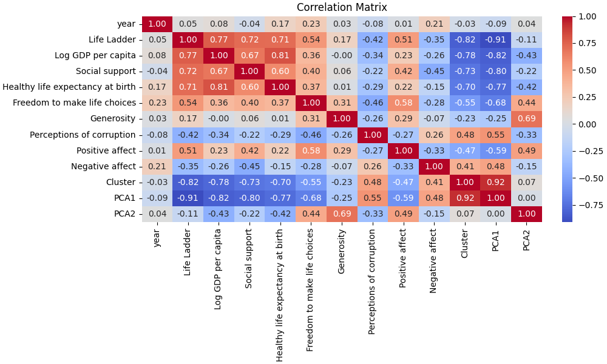

# Dataset Analysis of happiness.csv

## Dataset Analysis Story
In the realm of global well-being metrics, a dataset has emerged, crafted with the potential to unravel the intricate tapestry of life satisfaction, economic status, and social structures. This dataset encompasses 2,363 observations spanning 11 diverse attributes that offer a glimpse into the nuanced reality of life across various countries, evaluated from 2005 to 2023. The luxurious detail of this dataset enables an exploration into the factors that contribute to the so-called 'Life Ladder', a numerical representation of perceived happiness or satisfaction in life.

### Unveiling the Insights

**Summary Statistics:**
At a first glance, the dataset presents an average 'Life Ladder' score of approximately **5.48**. This score, indicative of moderate life satisfaction, oscillates from a low of **1.28** to a high of **8.02**. Here, we witness a **standard deviation of 1.13**, suggesting considerable variation in life satisfaction levels across countries. What stands out is that one-quarter of the countries reported scores below **4.65**, while the interquartile range reveals a gathering at **6.32**, signifying a subset of nations flourishing in happiness.

As we traverse through other attributes, the mean 'Log GDP per capita' is roughly **9.40**, corresponding to a broad spectrum where economies thrive on different scales. Notably, this metric of economic wealth is tightly knit to life satisfaction, as evidenced by its correlation (0.77) with the Life Ladder.

**Social Indicators:**
When examining social frameworks, 'Social support' emerges as a powerful pillar, boasting an average score of **0.81**. High scores suggest that many countries provide robust community networks, which likely enhance life satisfaction. Interestingly, 'Freedom to make life choices' holds an average of **0.75**, reflecting the importance of autonomy in the pursuit of happiness.

However, a sobering aspect emerges when we scrutinize the 'Generosity' variable, which exhibits a near-zero mean value, marked by a maximum of **0.7** and a perplexing minimum of **-0.34**. This manifestation of generosity—or lack thereof—raises questions about socio-economic disparities and their influence on community dynamics.

### Correlational Connections

The story deepens as we explore the correlation matrix. The relationship between 'Log GDP per capita' and 'Life Ladder', at **0.77**, substantiates the long-held belief that economic prosperity fuels happiness levels. Following closely, 'Social support' (0.72) and 'Healthy life expectancy at birth' (0.71) also show substantial positive correlations with life satisfaction, reinforcing that health and community connections are vital to nurture happiness.

Conversely, a notable negative correlation is observed between 'Life Ladder' and 'Perceptions of corruption' (-0.42). This indicates that higher levels of corruption perceptions are detrimental to life satisfaction levels. Countries perceived as corrupt tend to bring down the lived experience, likely through a loss of trust in institutions and increased anxiety among citizens.

### Outliers: A Deeper Dive

Digging deeper, we notice a marked presence of outliers in the dataset, particularly in 'Social support' (23 outliers) and 'Perceptions of corruption' (44 outliers). The existence of these outliers could suggest significant disparities in support systems or corruption perceptions in certain countries, potentially skewing the aggregate view. Countries with exceptionally high or low measurements in these domains warrant separate exploration to understand their unique narratives.

### Recommendations for Further Analysis

1. **Thematic Explorations:** A qualitative analysis could complement these quantitative insights, narrating how specific cultural, political, or economic frameworks influence life satisfaction across nations.
  
2. **Longitudinal Study:** Conduct a longitudinal analysis to track changes over time, particularly in response to global events, policy changes, or economic shifts, providing a dynamic view of life satisfaction trends.

3. **Multivariate Analysis:** Utilize advanced statistical techniques such as regression analysis to predict how combinations of predictors affect life satisfaction, offering a more nuanced understanding of relationships.

4. **Focus on Outliers:** By isolating outliers, researchers can extract valuable insights regarding the unique scenarios that elevate or diminish life satisfaction in certain locales, potentially revealing best practices or cautionary tales.

5. **Geographic Segmentation:** Exploring geographic differences can provide deeper insights into regional disparities, illuminating how cultural and environmental factors interplay with well-being metrics.

### A Concluding Reflection

In the intertwined realms of happiness, economy, and social fabric, this dataset serves as a treasure trove of insights waiting to be unpacked. As we navigate the patterns that emerge from the interplay of life satisfaction and various determinants, we uncover the global narrative of human experience. The quest for happiness is one formed within a complex ecosystem—one where economic factors, social support, health, and choice weave together to create the rich story of life itself. The charting of this journey enables us to gain foresight

## Visualizations

