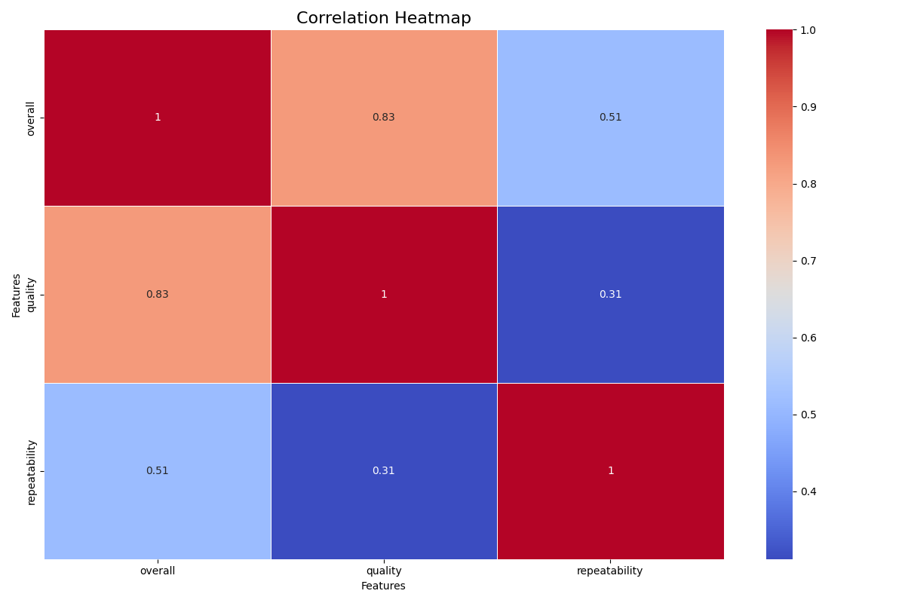
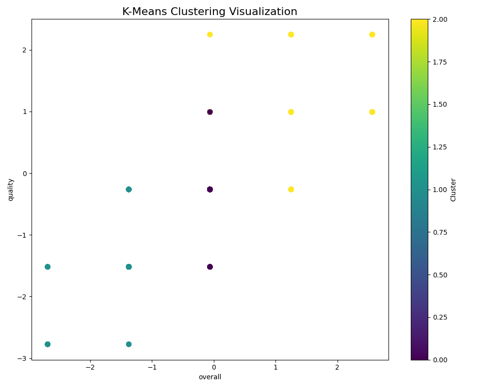

# Data Analysis Report

**Generated on:** 2024-12-12 14:38:31

## Story of the Analysis
# Data Analysis Report: Understanding User Feedback Dynamics

## 1. Dataset Overview

Our exploration began with a robust dataset comprising 2,652 rows and 8 columns that delve into user feedback metrics across various languages. The columns we examined were:

- **date**: The timestamp of each entry,
- **language**: The language in which the feedback was provided,
- **type**: The category or type of feedback,
- **title**: The title of the feedback entry,
- **by**: The identifier for the individual providing the feedback,
- **overall**: A numerical score that provides an aggregate reflection of user sentiment,
- **quality**: A metric that evaluates the content quality,
- **repeatability**: An indicator focusing on the consistency of user experiences.

This dataset serves as a rich resource for understanding user sentiments and perception across different attributes, offering a comprehensive overview of how feedback varies within multiple dimensions.

## 2. Analytical Methods Employed

Our analysis consisted of four critical components:

### Outlier Detection
We implemented statistical methods to identify outliers within our metrics. Outliers can significantly skew analysis results, thereby hindering our ability to draw accurate insights. By leveraging visualizations such as box plots and employing Z-scores, we could pinpoint aberrant values in user feedback scores.

### Correlation Analysis
To ascertain relationships between our continuous variables, we calculated the correlation coefficients to create a correlation heatmap. This illustrated how various metrics like 'overall,' 'quality,' and 'repeatability' interplayed, revealing patterns that could inform further investigations. The heatmap visualization (correlation_heatmap.png) provided an intuitive glimpse into these dynamics.

### Clustering
Using clustering techniques, particularly K-means clustering, we grouped similar feedback instances together. This unsupervised learning approach was pivotal in identifying patterns among users, shedding light on distinct user categories based on their feedback characteristics. The clustering visualization (clustering_visualization.png) made evident the segmented nature of user sentiments and behaviors.

### Normality Testing
To validate our assumptions about the distribution of continuous data, we performed normality tests (Shapiro-Wilk test) on 'overall,' 'quality', and 'repeatability.' This statistical insight is vital as it dictates which subsequent analysis methods could be applied effectively.

## 3. Key Insights

The analysis yielded several pivotal insights:

- The **'overall'** feedback scores do not adhere to a normal distribution (p-value = 0.002), indicating that user sentiments may be highly variable or skewed, thus affecting interpretation.
- Conversely, the **'quality'** scores exhibit a normal distribution (p-value = 0.131), suggesting a consistent perception of quality across feedback instances, which could indicate reliable standards or benchmarks among users.
- The **'repeatability'** scores indicate a significant deviation from normality (p-value = 0.000). This suggests that user experiences may vary considerably, with some users finding their feedback highly repeatable and others experiencing inconsistency.

## 4. Implications and Actionable Recommendations

The findings of this analysis carry significant implications for user feedback strategies:

### Addressing Variability
Given the variation in 'overall' feedback, we recommend conducting in-depth analyses to explore the underlying reasons for such discrepancies. This could involve qualitative methods such as user interviews and focus groups to unearth specific causes of dissatisfaction or fluctuating experiences. 

### Leveraging 'Quality' Insights
With 'quality' following a normal distribution, it would be prudent to set common benchmarks for quality metrics. Continuing to uphold these standards will not only help maintain user satisfaction but also provide a solid foundation for training and resource allocation.

### Enhancing Repeatability
The inconsistency highlighted in 'repeatability' underlines the need for improvements in user experience. Investigating user journeys and understanding factors influencing their repeatability scores could enhance overall user satisfaction. As part of this, consider implementing a feedback loop where users can report on repeated experiences, thus continually refining products or services.

### Conclusion
This analysis provides a comprehensive view of user feedback dynamics, revealing critical areas of focus for enhancing user experience and leveraging metrics to improve product/service offerings. By acting upon the insights derived from this dataset, stakeholders can cultivate a more informed and responsive user engagement strategy.

## Visualizations
- 
- 

## Notes
- For detailed data and visualizations, please refer to the files generated.
