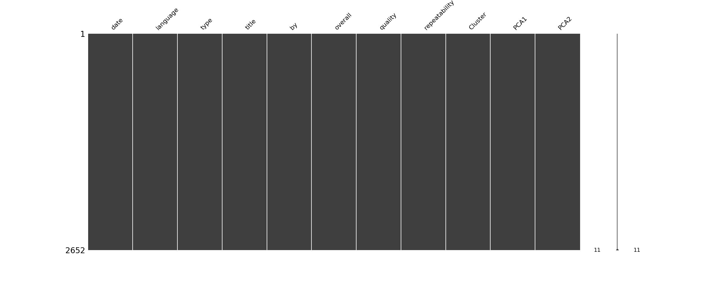
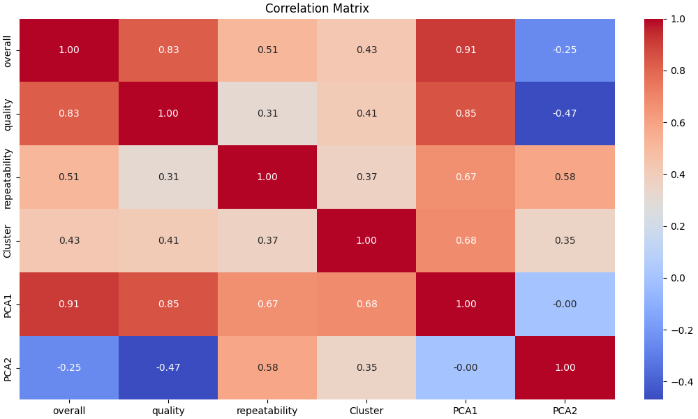
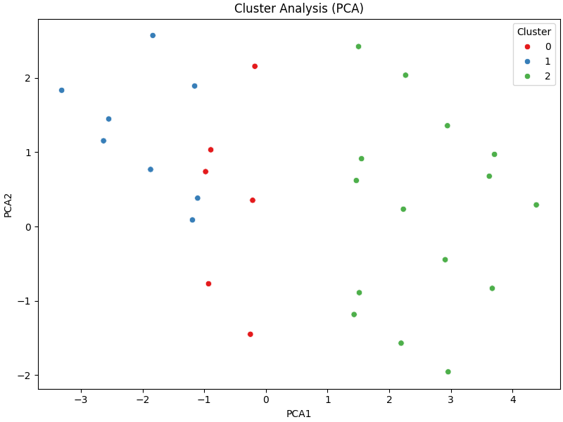

# Dataset Analysis of media.csv

## Dataset Analysis Story
### Data Analysis Report: Understanding the Dataset

Once upon a time in the land of data, a curious analyst set out on a journey to explore a dataset containing 2,652 rows and 8 columns. Each column narrated a unique aspect of a study that could reveal fascinating insights about human perceptions. The dataset included information such as the date of review, language, type of content, title, the author ("by"), and three numerical ratings: overall, quality, and repeatability. With a thirst for knowledge, the analyst began to unravel the mysteries hidden within the numbers.

---

#### Descriptive Statistics: The Heartbeat of the Data

As our analyst delved deeper, they uncovered the essence of the dataset through its descriptive statistics. 

1. **Overall Rating**:
   - **Mean**: 3.05
   - **Range**: 1 to 5
   - This suggested that the majority of the ratings gravitated around the average score of 3, with a standard deviation of 0.76, indicating some variability but not excessive divergence from the mean. The interquartile range also suggested a tight clustering of most ratings around the value of 3.

2. **Quality Rating**:
   - **Mean**: 3.21
   - **Range**: 1 to 5
   - The quality scores followed a similar pattern to overall ratings, slightly higher but still central to 3. With a standard deviation of around 0.80, it also indicated some respondents were notably more satisfied.

3. **Repeatability Rating**:
   - **Mean**: 1.49
   - **Range**: 1 to 3
   - Here, the mean was lower than both overall and quality ratings, suggesting that repeatability was often rated as low, indicating potential issues in content consistency. The compact range (1 to 3) indicates not just low repeatability but also that most respondents were in agreement.

---

#### Missing Values and Outliers: Analyzing Quality Assurance

Our interested analyst noted with relief that the dataset had no missing values, allowing for confidence in the integrity of the data while analyzing it. Furthermore, upon careful inspection, the analyst found that there were no outliers in the ratings, allowing them to proceed with the satisfaction that the data had been collected consistently and accurately.

---

#### Correlation Matrix: The Connections Between Friends

In a moment of excitement, the analyst calculated the correlation matrix, which unraveled the relationships among the ratings:

- **Overall vs. Quality**: 0.83
  - This strong positive correlation suggested that as the quality rating increased, so did the overall rating, indicating that respondents perceived higher-quality content to be more satisfying.

- **Overall vs. Repeatability**: 0.51
  - This moderate correlation revealed a reasonable relationship between overall satisfaction and repeatability, suggesting that while content that garners higher engagement seems to display reasonable repeatability, it wasn’t a definitive factor.

- **Quality vs. Repeatability**: 0.31
  - A weaker correlation signified that repeatability had less influence on the perception of quality, implying that the quality of content could be perceived as high even if the content was not particularly consistent or repeatable.

---

### Insights and Recommendations

The analyst recognized the significance of these insights and understood that they could illuminate ways to improve user experience and content delivery. Given the high correlations, the following recommendations were crafted:

1. **Enhance Content Quality**: Focus on improving the aspects of content that influence quality to increase overall satisfaction. This could involve targeting specific elements of content creation that users identify as impactful.

2. **Investigate Repeatability**: Given the low repeatability scores, it would be prudent to explore why content doesn’t seem to consistently meet expectations. Surveying users for feedback on what they find lacks consistency could pinpoint areas for improvement.

3. **Segment Analysis**: Investigate whether specific languages, content types, or titles tend to skew ratings higher or lower, which could lead to more tailored content strategies.

4. **Further Exploration of Outliers**: While the current dataset showed no outliers, future reviews may benefit from cross-referencing with external data to identify patterns or trends not captured in this analysis. 

In conclusion, our diligent analyst, with their newfound knowledge, paved the way for further exploration into how content can be smoothed and shaped to meet and exceed the expectations of users, all while enhancing the overall experience. The dataset, once just a collection of figures and text, now stood as a powerful ally in the quest for greater understanding, engagement, and satisfaction. And so, the data journey continued.

## Visualizations

