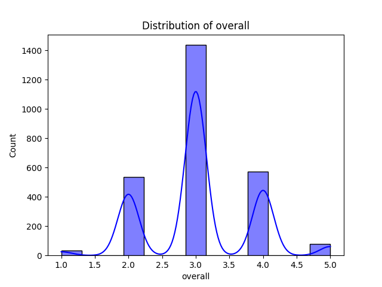

# Automated Dataset Analysis

## Dataset Summary
- Number of Rows: 2652
- Number of Columns: 8
### Columns and Data Types:
- date: object
- language: object
- type: object
- title: object
- by: object
- overall: int64
- quality: int64
- repeatability: int64

## Analysis Narrative
Based on the provided summary of the dataset, we can derive several insights and analyses related to the data structure, quality, and potential areas for further exploration. Here’s a comprehensive breakdown:

### Dataset Overview
- **Total Rows**: 2,652
- **Total Columns**: 8
- **Column Types**:
  - **Date**: Object (string format)
  - **Language**: Object (string format)
  - **Type**: Object (string format, all entries are 'movie')
  - **Title**: Object (string format)
  - **By**: Object (string format, likely to contain multiple names)
  - **Overall Rating**: Integer (scale not specified)
  - **Quality Rating**: Integer (scale not specified)
  - **Repeatability**: Integer (likely a binary indicator)

### Missing Values
- **Date**: 99 missing values, which is about 3.73% of the dataset. This could potentially impact time-based analyses or trends.
- **By**: 262 missing values, which is approximately 9.87%. This could indicate a significant number of entries where contributors are not specified.
- Other columns do not have missing values, indicating good data integrity in those areas.

### Sample Data Insights
- The sample data shows that all entries are movies, with a mix of Tamil and Telugu languages.
- The **Overall Ratings** range from 2 to 4, while the **Quality Ratings** are also in a similar range, suggesting a generally moderate perception of quality.
- The **Repeatability** is consistently 1, which might indicate that these entries are unique and not duplicated across the dataset.

### Insights and Analysis
1. **Language Distribution**:
   - Since the sample includes only Tamil and Telugu, a deeper analysis of language distribution will help understand the dataset's diversity. You can calculate the proportion of movies in each language.

2. **Rating Analysis**:
   - Analyzing the distribution of overall and quality ratings will help identify patterns in viewer satisfaction. For instance, creating histograms can show if there are more high or low ratings.
   - You might also want to calculate the average overall and quality ratings for each language to see if there's a significant difference in how movies are rated across languages.

3. **Impact of Contributors**:
   - Since there are many missing values in the 'by' column, this could affect analyses focused on the impact
## Visualizations
1. Correlation Matrix:

2. Distribution Plot:

